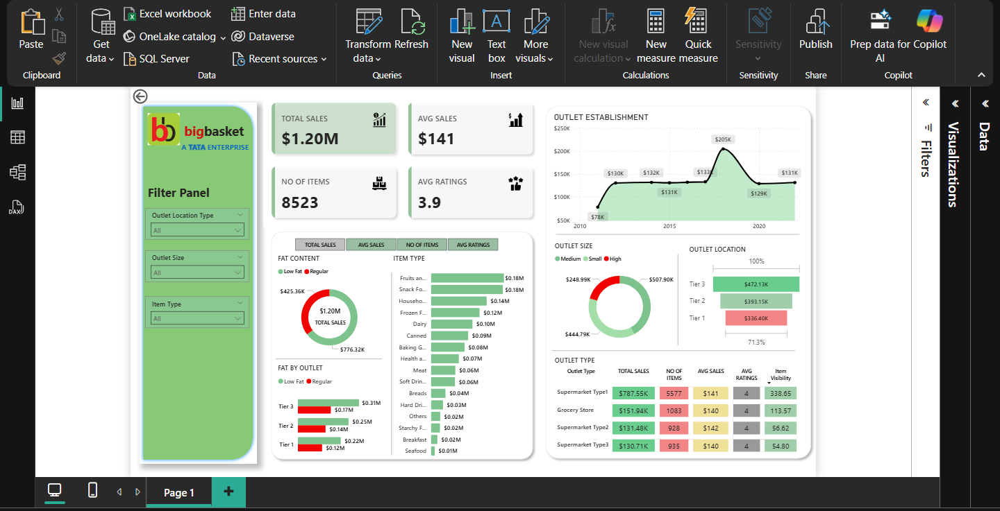

# Big Basket Sales Dashboard - Power BI Project

## Overview
This Power BI dashboard presents a comprehensive analysis of sales performance using a dataset inspired by **Big Basket**, one of India’s leading online grocery stores. The dashboard offers insights into total sales, product categories, outlet types, and customer behavior across different outlet locations.

## Key Features
- **KPIs**: Total Sales, Average Sales, Number of Items, Average Ratings
- **Dynamic Filters**: Filter Panel with Outlet Type, Size, and Item Type
- **Outlet Establishment Trends**: Sales trends across establishment years
- **Fat Content Analysis**: Distribution of sales by Fat Type and Outlet
- **Outlet Size & Location Breakdown**:
  - Pie and bar charts for outlet size and performance
  - Tier-wise outlet location performance
- **Detailed Table View**:
  - Sales and ratings breakdown by outlet type
  - Includes metrics like Item Visibility and Number of Items

## Tools & Skills Used
- **Power BI Desktop**
- **Power Query** for data cleaning and transformation
- **DAX** (Data Analysis Expressions) for calculated metrics
- **Data Visualization & Design**
- **Excel** (for original dataset)

## What I Learned
- Built calculated measures using DAX (KPIs, Aggregates)
- Applied effective chart selection for visual storytelling
- Created a professional, interactive dashboard layout
- Learned the importance of filters and drill-down navigation

## File Structure
- `bigbasket.dashboard.pbix` – Power BI project file
- `bigbasket.dashboard.png` – Screenshot of the final dashboard
---

> **Note**: This is a personal learning project and not affiliated with Big Basket or Tata Enterprise.

